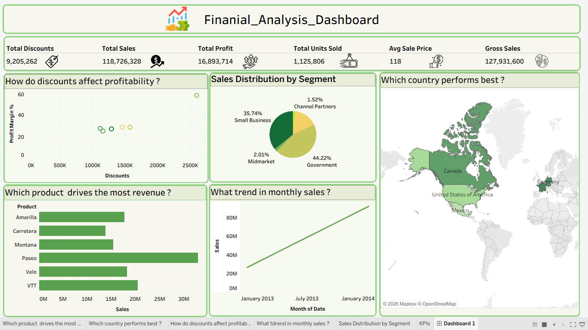

# 📊 Financial Analysis Dashboard | Tableau

An interactive, end-to-end Financial Analysis Dashboard built in **Tableau** to evaluate business performance, sales distribution, profitability drivers, and geographic trends.

---

## 📸 Dashboard Preview

  

---

## 🚀 Project Overview
This project delivers deep financial insights into sales performance across various segments, products, countries, and discount strategies. It transforms raw financial records into actionable business intelligence through a clean, executive-level layout.

---

## 📌 Key Performance Indicators (KPIs)
* **Total Sales:** $118.7M
* **Total Profit:** $16.89M
* **Gross Sales:** $127.93M
* **Total Discounts:** $9.2M
* **Total Units Sold:** 1.12M
* **Average Sale Price:** $118

---

## 📈 Key Insights & Dashboard Sections
1. **Profitability vs. Discounts:** Analyzes how different discount strategies impact overall profit margins.
2. **Sales Distribution by Segment:** Breaks down market share across Government, Small Business, Midmarket, and Channel Partners.
3. **Geographic Performance:** Highlights top-performing countries (such as Canada, USA, and Germany) using an interactive map.
4. **Product Revenue Drivers:** Identifies top-selling products (Paseo, VTT, Amarilla, etc.) contributing the highest revenue.
5. **Monthly Sales Trends:** Tracks revenue growth over time to spot seasonal patterns and business expansion.

---

## 🛠️ Tools & Technologies
* **Tableau:** Data visualization and interactive dashboard creation.
* **Microsoft Excel / Data Source:** Data preparation and cleaning.
* **Figma / Design Tools:** Custom background and layout structuring.

---

## 👤 Author
**Shahd Mohamed Sayed Ahmed**  
*Junior Data Analyst & Business Intelligence Enthusiast*
